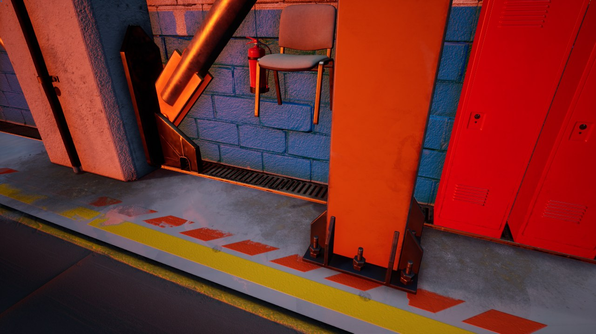
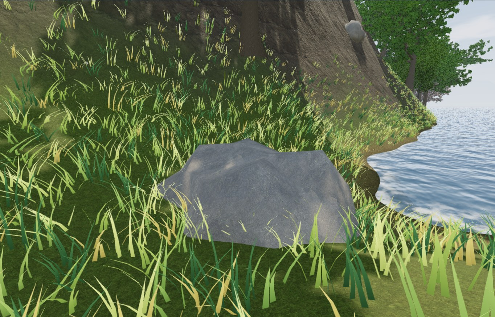
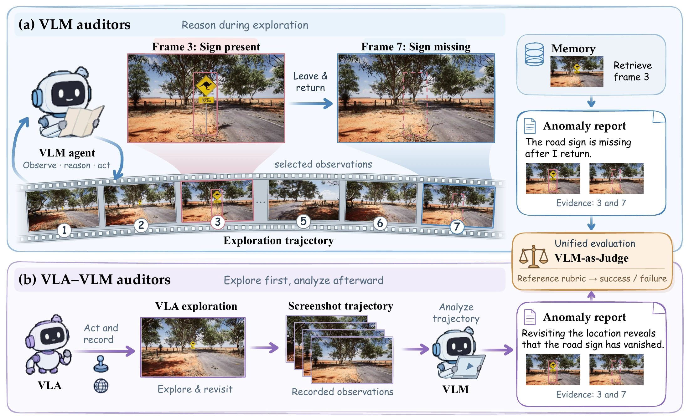

<div align="center">

<h1> WorldAuditBench</h1>
<h3>Interactive 3D World Auditing with Multimodal Agents</h3>

<p>
  <a href="https://xmhzz2018.github.io/">Ziyan Jiang</a><sup>1,*</sup> ·
  <a href="https://kimperyang.github.io/">Jingbo Yang</a><sup>1,*</sup> ·
  <a href="https://question406.github.io/">Jiabao Ji</a><sup>1,*</sup> ·
  <a href="https://yujianll.github.io/">Yujian Liu</a><sup>1</sup><br>
  <a href="https://wuqiuche.github.io/">Qiucheng Wu</a><sup>1</sup> ·
  <a href="https://people.csail.mit.edu/tommi/">Tommi Jaakkola</a><sup>2</sup> ·
  <a href="https://mitibm.mit.edu/people/yang-zhang/">Yang Zhang</a><sup>3</sup> ·
  <a href="https://code-terminator.github.io/">Shiyu Chang</a><sup>1</sup>
</p>
<p><sup>1</sup> UC Santa Barbara &nbsp; <sup>2</sup> MIT CSAIL &nbsp; <sup>3</sup> MIT-IBM Watson AI Lab<br><sup>*</sup> Equal contribution</p>

<p>
  <a href="https://ucsb-nlp-chang.github.io/WorldAuditBench/assets/worldauditbench.pdf"></a>
  <a href="https://ucsb-nlp-chang.github.io/WorldAuditBench/"></a>
  <a href="#resources"></a>
  <a href="https://ucsb-nlp-chang.github.io/WorldAuditBench/#explore"></a>
</p>

**213 tasks · 13 environments · 5 anomaly families · 2 auditing paradigms**

</div>

WorldAuditBench evaluates whether multimodal agents can **explore a 3D world, investigate suspicious observations, and identify anomalies with visual evidence**. It covers both Unreal Engine 5 and Three.js environments, from furnished interiors to cities and open landscapes.

**[Demonstrations](#demonstrations)** · **[Benchmark](#benchmark)** · **[Quick start](#quick-start)** · **[Evaluation](#evaluation)** · **[Resources](#resources)** · **[Citation](#citation)**

## Demonstrations

| Floating objects | Missing collisions | Objects that disappear |
| :---: | :---: | :---: |
| [](https://ucsb-nlp-chang.github.io/WorldAuditBench/#explore) | [](https://ucsb-nlp-chang.github.io/WorldAuditBench/#explore) | [](https://ucsb-nlp-chang.github.io/WorldAuditBench/#explore) |

Watch the recorded demonstrations and explore all **15 anomaly types** on the [project page](https://ucsb-nlp-chang.github.io/WorldAuditBench/#explore).

## Benchmark

Auditing requires more than recognizing an unusual image. An agent may need to approach an object, test a collision, change its viewpoint, or revisit a location to establish what is wrong.

| Anomaly family | Examples | Tasks |
| --- | --- | ---: |
| Static physics | Floating objects, intersections, implausible scale | 59 |
| Interactive physics | Missing or unexpected collisions, abnormal trajectories | 41 |
| Spatial consistency | Visibility, viewpoint, lighting, and material inconsistencies | 51 |
| Temporal consistency | Changes in existence, attributes, or operational state | 40 |
| Semantic consistency | Improper configurations and historical incompatibilities | 22 |
| **Total** | **126 Unreal Engine 5 + 87 Three.js tasks** | **213** |

The paper compares two auditing paradigms:

- **VLM agents:** reason during exploration and choose their next actions using observations and evidence memory, with a budget of **40 actions**.
- **VLA + VLM:** a VLA explores for **60 simulated seconds**, then a VLM analyzes the recorded trajectory.

<p align="center">
  
</p>

The strongest evaluated agent reaches **42.3%** success, compared with **83.4%** for humans. See the [interactive results](https://ucsb-nlp-chang.github.io/WorldAuditBench/#results) and [paper](https://ucsb-nlp-chang.github.io/WorldAuditBench/assets/worldauditbench.pdf) for the full comparison.

## Quick start

### 1. Install

Use **Python 3.11+** on Linux or macOS for the Python tools. Running Unreal environments requires a configured Linux GPU host and the environment packages listed under [Resources](#resources).

```bash
git clone https://github.com/UCSB-NLP-Chang/WorldAuditBench.git
cd WorldAuditBench

python3 -m venv .venv
source .venv/bin/activate
python -m pip install -r requirements.txt
```

### 2. Explore the evaluation set

Task definitions and splits are available in this repository. The following example runs without environment downloads or model credentials:

```python
import json
from pathlib import Path

benchmark = json.loads(Path("benchmark/paper-tasks.json").read_text())
print(benchmark["counts"])  # {'total': 213, 'unreal': 126, 'threejs': 87}

for task in benchmark["tasks"][:3]:
    print(task["id"], task["environment"], task["title"])
```

Use [`benchmark/paper-tasks.json`](benchmark/paper-tasks.json) and [`benchmark/splits/`](benchmark/splits/) for paper experiments. The separate `benchmark/tasks.json` catalog also contains review and baseline entries and is not the paper evaluation split.

### 3. Set up an auditor

The paper's VLM auditors run through native model clients and a shared MCP tool interface. Prepare their Python runtime:

```bash
python scripts/native-agents/setup.py
python scripts/native-agents/launch.py --help
```

Install and authenticate the native client you plan to use: Codex, Claude Code, Gemini CLI, OpenCode, or Qwen Code. See the [native-agent guide](docs/native-agent-mcp.md) for configuration and the [reproduction guide](docs/reproduction.md) for exact model and reasoning settings.

**Full auditing runs require the environment packages and demonstration assets, which are pending release on Hugging Face.** Once these resources are restored and an isolated Unreal bridge is running, an example episode is:

```bash
python scripts/native-agents/launch.py gemini \
  --environment unreal-http --env-url http://127.0.0.1:19100 \
  --task S03 --model gemini-3.8-flash --gemini-thinking medium \
  --max-actions 40 --max-tool-calls 400 --require-full-budget \
  --observation on-demand --run-dir out/runs/gemini-S03
```

For Three.js configuration, VLA exploration, trajectory replay, and ablations, follow the [reproduction guide](docs/reproduction.md).

## Evaluation

Agents submit anomaly reports with supporting visual evidence. The judge evaluates each report against the task rubric and returns a binary success score with an explanation. The paper reports success over the fixed **213-task** evaluation set.

| Workflow | Code / documentation |
| --- | --- |
| Interactive VLM auditing | [`scripts/native-agents/launch.py`](scripts/native-agents/launch.py) · [MCP tools](docs/native-agent-mcp.md) |
| VLA exploration | [`harness/vla_ue.py`](harness/vla_ue.py) · [`harness/vla_explore.py`](harness/vla_explore.py) |
| Analysis of VLA trajectories | [`scripts/native-agents/run_vla_replay.py`](scripts/native-agents/run_vla_replay.py) |
| Report judging | [`eval/judge.py`](eval/judge.py) · [Judge protocol](docs/binary-judge.md) |
| Ablation experiments | [`experiments/ablations/`](experiments/ablations/) · [Protocol settings](docs/reproduction.md#ablations) |

## Resources

Code, task definitions, and evaluation splits are available now. Larger resources will be released on **Hugging Face**.

| Resource | Availability |
| --- | --- |
| Benchmark task definitions and splits | [Available](benchmark/) |
| Auditing agents, evaluation, and environment source | Available in this repository |
| Demonstration videos | [Project page](https://ucsb-nlp-chang.github.io/WorldAuditBench/#explore) |
| Packaged environments and editable scene assets | Coming soon |
| In-context demonstration images and VLA trajectories | Coming soon |
| Open-P2P model setup and checkpoint instructions | Coming soon |

See [resource details](docs/resources.md) for the files required to run the benchmark. Third-party environments and models retain their respective licenses; see [THIRD_PARTY.md](THIRD_PARTY.md).

## Repository structure

```text
benchmark/              Task definitions, scene descriptions, and evaluation splits
scripts/native-agents/  Native model clients and experiment launchers
auditor/mcp_agent/      Shared auditing tools and environment connections
agent/                  Tool-calling VLM agent and evidence memory
harness/                VLA exploration and environment runners
eval/                   Report judges and evaluation utilities
candidate_environments/ Three.js environment source
env/                    Environment adapters
unreal/                 Unreal source, plugins, and runtime policies
experiments/ablations/   Ablation implementations
services/               Human exploration, review, and evaluation interfaces
docs/                   Setup, protocols, and resource documentation
```

### Development checks

```bash
python -m pip install -r requirements-dev.txt
python scripts/check_release.py
python -m pytest -q -m 'not chromium and not live'
```

These checks cover code and interfaces; they do not launch the full benchmark. See [validation details](docs/validation.md) for resource-dependent checks.

## Citation

```bibtex
@misc{jiang2026worldauditbench,
  title  = {WorldAuditBench: Interactive 3D World Auditing
            with Multimodal Agents},
  author = {Ziyan Jiang and Jingbo Yang and Jiabao Ji and
            Yujian Liu and Qiucheng Wu and Tommi Jaakkola and
            Yang Zhang and Shiyu Chang},
  year   = {2026},
  url    = {https://ucsb-nlp-chang.github.io/WorldAuditBench/}
}
```

For questions or bug reports, please [open an issue](https://github.com/UCSB-NLP-Chang/WorldAuditBench/issues).
